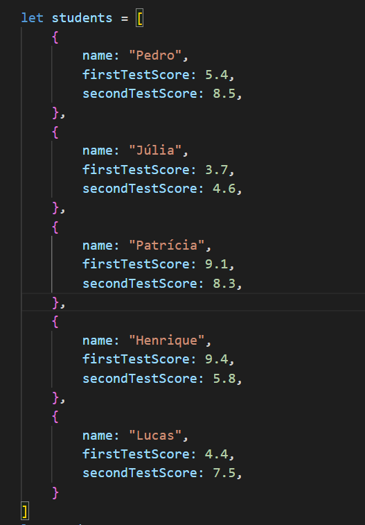
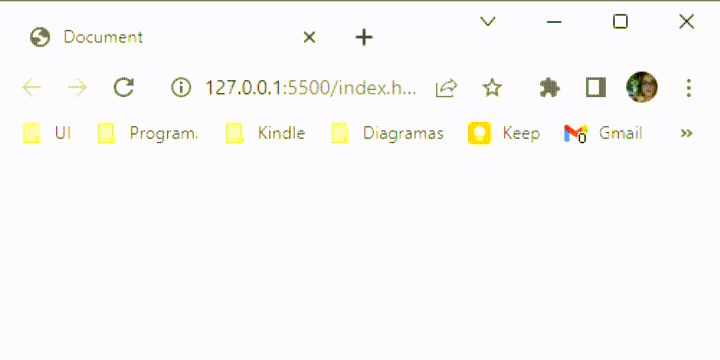

<h1 align="center">Final grade in JS</h1>

<strong>PT-BR</strong>: Média de notas com JS

 

  

 

## 🚀 Technologies 
<strong>EN:</strong> This project was developed with the following technologies:

-----
<strong>PT-BR:</strong> Esse projeto foi desenvolvido com as seguintes tecnologias:

- JavaScript
- Git e Github

 

## 📖 Concepts
<strong>EN:</strong> Concepts:
 - Data structure with objects and array;
 - Repetition structure: "for - of";
 - Functions;
 - Comparative operators
 
----

<strong>PT-BR:</strong> Conceitos utilizados:

 - Estrutura de dados com objetos e array;
 - Estrutura de repetição: for - of;
 - Função;
 - Operadores comparativos;

 

## 🖥️ Project
<strong>EN:</strong> Project made in Rocketseat's course "Explorer".
Starting with the basics of JavaScript!
 
The challenge is to create a list of students with the following data: 
 - name;
 - first test score;
 - second test score.

Then, create a function that calculates the final grade of each student. Considering that the student needs to have a final grade of at least 7, verify if each estudent passed or not in the test with a message saying that.
 

----
<strong>PT-BR:</strong> Projeto feito no curso Explorer da Rocketseat. Começando com o básico do JavaScript!
 
Nesse desafio o objetivo é criar uma lista de estudantes e, cada estudante dentro dessa lista deverá conter os seguintes dados:
- nome;
- nota da primeira prova;
- nota da segunda prova.

Depois criar uma função que irá calcular a média das notas de cada aluno, considerando que a média para esse concurso é 7, verificar se cada aluno obteve sucesso ou não em entrar no concurso e mostrar uma mensagem na tela.
 
 
- Online project: https://lidiabrentano.github.io/final-grade-js/
 

-----

By Lídia Brentano 💜
